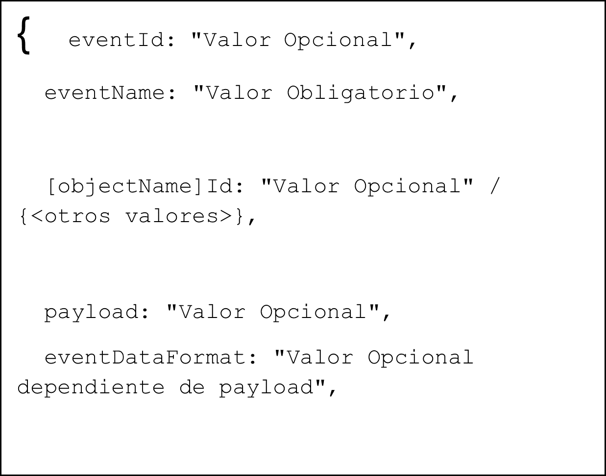

Elementos del estilo EDA:

-   **Origen del Evento**: Event-Driven (origen en otro evento al ser el
    resultado una acción)

-   **Tipos de Eventos**:

    -   [Notificación/Informativo]{.underline}: información que NO
        debería generar una respuesta o cambio en el sistema.

    -   [Alerta]{.underline}: información que debería generar una
        respuesta o cambio en el sistema -\> Enfoque Transacción

    -   [Objeto]{.underline}: registro de un evento a nivel datos y no
        de comportamiento

    -   [Negocio]{.underline}: puede contener datos que ayudan a definir
        el contexto de un evento -\> Serían sus propiedades de
        aplicación (Por ejemplo, el id interno del sensor sobre el que
        aplica). En algunos casos esto puede activar un cambio
        permanente en el sistema.

    -   [Agrupación (evento complejo]{.underline}): abstracción de alto
        nivel de más de un evento.

-   **Contenido del evento**:

    -   Se suele implementar como un enfoque de \"Entidad\" / \"Entity\"
        (Clase con atributos).

    -   [Particularización]{.underline}**:** Construir eventos
        específicos para cada uno de los casos de uso (atributos propios
        con lo que se trabaja, naming concreto, etc.)

    -   El uso de un atributo identificador (id, eventId, etc.), permite
        diferenciarlo o reconocerlo frente al resto de eventos.

    -   Existen diferentes formas de implementar este atributo:
        secuencia, timestamp, generador de ids, etc.

    -   [Occurred]{.underline}: Cuando el evento ya ha ocurrido -\> Se
        suele expresar en un tiempo verbal pasado.

    -   [Arrived]{.underline}: Cuando el evento se va a producir o se
        quiere que se produzca -\> Se suele expresar en un tiempo verbal
        infinitivo / imperativo.

    -   La relación con objetos de negocio (dependerá de los objetos a
        los que haga referencia).

    -   [Tipología]{.underline}:

        -   **Property-based**: Uso de uno o varios atributos que
            referencian a las propiedades no identificativas del
            objeto/s de negocio en el mismo nivel que los atributos del
            evento. Se suelen representar con el nombre del atributo al
            que hace referencia

        -   **Id-based**: Uso de uno o varios atributos que referencian
            a los identificadores del objeto/s en el mismo nivel que los
            atributos del evento. Se suele representar por el atributo
            \[objectName\]Id

        -   **Payload-based**: Uso de un atributo que referencia al
            objeto/s pero que va establecido como valor de un atributo
            \"payload\" del evento donde se puede guardar casi cualquier
            cosa. Se suele representar por el atributo payload

    -   El uso de atributos con [relevancia en el tiempo]{.underline}
        (\[timeCriteria\] que puede ser creationDate, updateDate,
        duration, \...)

    -   El uso de un atributo de **autoría** (author), hace referencia
        al usuario que lo creó, puede ser un dispositivo, una persona,
        una aplicación, etc.

-   **Representación del evento:** para homogeneizar todos desarrollos y
    mantener estas características de representación a lo largo del
    tiempo, crear una nomenclatura específica y formalizar los valores
    del contenido.

    -   Sistema de representación: Formato JSON

    -   Con esquema:
   
